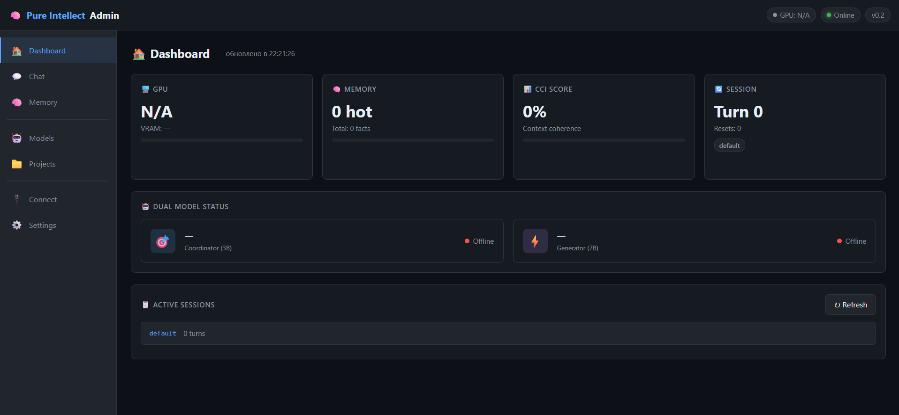

# 🧠 Pure Intellect

> **Local AI with unlimited hierarchical memory — 85% fewer tokens, 100% privacy**

[](LICENSE)
[](https://python.org)
[](tests/)
[](https://github.com/Remchik64/pure-intellect)



Pure Intellect solves the fundamental problem of LLM context limitation — **context degradation in long conversations**. Instead of losing information when context fills up, the system creates a "coordinate" (compressed memory snapshot) and performs a **soft reset**, maintaining full conversational continuity.

---

## ✨ Key Features

### 🧠 Hierarchical Memory System
- **Working Memory (HOT)** — active facts with attention scoring
- **Memory Storage (WARM)** — semi-active facts, semantic search via SentenceTransformers
- **Archive (COLD)** — compressed historical data
- **Anchor Facts** — critical information that never decays
- **Smart Eviction** — auto-evict low-importance facts when RAM pressure > 80%

### 🎯 Soft Reset with Coordinates
- Context fills up → 3B model creates a **coordinate** (compressed snapshot)
- Context resets to zero, coordinate injected as first message
- **100% recall** across resets — tested and proven
- **Adaptive reset** — triggers by CCI score, not just turn count

### 📊 Context Coherence Index (CCI)
- Real-time tracking of conversational coherence (0.0 → 1.0)
- CCI < 0.55 + turns ≥ 4 → automatic soft reset
- Hard limit: turns ≥ 16 → forced reset regardless of CCI
- Restores context automatically when coherence drops

### 🤖 Dual Model Architecture
- **Coordinator (3B)** — fast navigation, intent detection, coordinate creation
- **Generator (7B)** — high-quality response generation
- **CPU+GPU Split** — partial offload for systems with limited VRAM
- **Dynamic model switching** — change models without server restart

### 💻 Code Module
- Index Python projects into ChromaDB for semantic search
- **RAG** — automatically inject relevant code context into prompts
- **Watcher** — auto-reindex files on change (debounced, hash-checked)
- **Code-Aware Memory** — code facts automatically stored in working memory

### 🔌 OpenAI-Compatible API
- `POST /v1/chat/completions` — standard OpenAI format
- `GET /v1/models` — model list
- **Agent Zero**, **Open WebUI**, **LM Studio** connect in 30 seconds
- Memory works transparently for any OpenAI-compatible client

### 🖥️ Admin Panel
- Full web interface at `http://localhost:8085`
- **Dashboard** — real-time GPU, CCI, memory metrics
- **Models** — hardware detection + model recommendations + download
- **Memory** — view/search/delete facts and coordinates
- **Projects** — code indexing, watcher control
- **Connections** — copy configs for Agent Zero / Open WebUI
- **Settings** — CCI threshold, memory limits (live config)

### 🔍 Hardware Detection
- Auto-detects GPU (NVIDIA/AMD/Apple Silicon)
- Recommends optimal models based on VRAM:
  - VRAM ≥ 10GB → GPU FULL (qwen2.5:7b)
  - VRAM 6-10GB → GPU SPLIT (partial CPU offload)
  - VRAM 3-6GB → GPU LIMITED (3B models)
  - No GPU → CPU ONLY mode

---

## 🚀 Quick Start

### Option 1: Installer Script (Recommended)

**Windows:**

📥 [**Скачать install.bat**](https://raw.githubusercontent.com/Remchik64/pure-intellect/main/install.bat) — или через PowerShell:

```powershell
# Открыть PowerShell и выполнить:
Invoke-WebRequest -Uri https://raw.githubusercontent.com/Remchik64/pure-intellect/main/install.bat -OutFile install.bat
# Затем Right-click → Запуск от имени администратора
# или:
.\install.bat
```

> **Прямая ссылка на файл:**
> `https://raw.githubusercontent.com/Remchik64/pure-intellect/main/install.bat`


**Linux / macOS:**
```bash
curl -fsSL https://raw.githubusercontent.com/Remchik64/pure-intellect/main/install.sh | bash
# or download and run:
bash install.sh
```

The installer will:
1. ✅ Check Python 3.11+
2. ✅ Install Ollama automatically
3. ✅ Install Pure Intellect via pip
4. ✅ Create desktop shortcut / launcher
5. ✅ Launch the server

### Option 2: Manual Installation

```bash
# 1. Install Ollama
curl -fsSL https://ollama.com/install.sh | sh

# 2. Install Pure Intellect
pip install git+https://github.com/Remchik64/pure-intellect.git

# 3. Start server
pure-intellect serve

# 4. Open browser
# http://localhost:8085
```

### First Run

After installation, open `http://localhost:8085` and:
1. Go to **🤖 Models** section
2. Click **"Определить железо"** (Detect Hardware)
3. See recommendations for your system
4. Click **"Скачать"** (Download) to get recommended models
5. Start chatting! 🎉

---

## 🔌 Integration with Agent Zero

Pure Intellect acts as a **memory middleware** between Agent Zero and Ollama:

```
Agent Zero → Pure Intellect (memory layer) → Ollama
```

Configure Agent Zero:
```json
{
  "chat_model": {
    "provider": "openai",
    "name": "pure-intellect",
    "kwargs": {
      "api_base": "http://localhost:8085/v1",
      "api_key": "pure-intellect"
    }
  }
}
```

Agent Zero gets memory for free — no code changes needed!

---

## 🔌 Integration with LM Studio

**LM Studio as backend for Pure Intellect:**
```yaml
# config.yaml
generator:
  provider: lmstudio
  base_url: http://localhost:1234
  model: your-model-name
```

**Pure Intellect as backend for LM Studio:**
```
LM Studio → Remote Server
URL: http://localhost:8085/v1
```

---

## 📊 Performance

| Metric | Without Memory | With Pure Intellect |
|--------|---------------|--------------------|
| Context tokens per turn | ~8000 | ~1200 |
| Token reduction | baseline | **85% fewer** |
| Recall after reset | 0% | **100%** |
| Supported conversation length | ~50 turns | **Unlimited** |
| Embedding speed | N/A | **5ms/fact (CUDA)** |

---

## 🏗️ Architecture

```
┌─────────────────────────────────────────────────────┐
│                   Pure Intellect                     │
│                                                     │
│  ┌──────────┐  ┌──────────┐  ┌──────────────────┐  │
│  │  Intent  │  │   CCI    │  │  Memory System   │  │
│  │ Detector │  │ Tracker  │  │  HOT/WARM/COLD   │  │
│  └────┬─────┘  └────┬─────┘  └────────┬─────────┘  │
│       │              │                  │            │
│  ┌────▼──────────────▼──────────────────▼─────────┐ │
│  │              OrchestratorPipeline               │ │
│  │  Soft Reset │ Coordinate │ Adaptive CCI Reset   │ │
│  └────┬───────────────────────────────────────────┘ │
│       │                                             │
│  ┌────▼──────────────────────────────────────────┐ │
│  │           Dual Model Router                   │ │
│  │  Coordinator (3B) │ Generator (7B)            │ │
│  └────┬──────────────────────────────────────────┘ │
│       │                                             │
│  ┌────▼──────────────────────────────────────────┐ │
│  │  Code Module │ Watcher │ Semantic Search        │ │
│  └───────────────────────────────────────────────┘ │
└─────────────────────────────────────────────────────┘
         │
    Ollama / LM Studio / Any OpenAI-compatible
```

---

## 📁 Project Structure

```
pure-intellect/
├── src/pure_intellect/
│   ├── api/          # FastAPI routes, WebSocket
│   ├── core/
│   │   ├── memory/   # Fact, WorkingMemory, Storage, Scorer, Optimizer
│   │   ├── orchestrator.py  # Main pipeline
│   │   ├── code_module.py   # Code indexing + RAG
│   │   ├── code_memory.py   # Code-aware facts
│   │   ├── session_manager.py
│   │   ├── dual_model.py    # 3B/7B router
│   │   └── watcher.py       # File change monitoring
│   ├── engines/      # Ollama provider, config loader
│   ├── utils/        # Hardware detector, tokenizer
│   └── static/       # Admin Panel (index.html)
├── tests/            # 465 tests
├── install.bat       # Windows installer
├── install.sh        # Linux/macOS installer
├── config.yaml       # Configuration
└── pyproject.toml
```

---

## ⚙️ Configuration

```yaml
# config.yaml
server:
  host: 0.0.0.0
  port: 8085

coordinator:
  model: qwen2.5:3b    # Fast model for navigation

generator:
  model: qwen2.5:7b    # Smart model for responses
  num_gpu: -1          # -1 = auto, 0 = CPU, N = N layers on GPU

memory:
  hot_facts_max: 50
  soft_reset_turns: 8
  adaptive_reset:
    enabled: true
    cci_threshold: 0.55
    min_turns: 4
    hard_limit_turns: 16

cci:
  window_size: 5
  reset_threshold: 0.55
```

---

## 🧪 Development

```bash
# Clone
git clone https://github.com/Remchik64/pure-intellect
cd pure-intellect

# Setup
python -m venv venv
source venv/bin/activate  # Linux/macOS
.\venv\Scripts\activate   # Windows
pip install -e .

# Run tests (unit only, fast)
python -m pytest tests/ -q \
  --ignore=tests/test_live_memory.py \
  --ignore=tests/test_system_full.py

# Run server
pure-intellect serve --port 8085
```

---

## 📈 Roadmap

- [x] Hierarchical memory (HOT/WARM/COLD)
- [x] Soft Reset with coordinates
- [x] Context Coherence Index (CCI)
- [x] Dual Model Router (3B coordinator + 7B generator)
- [x] Semantic search with SentenceTransformers (CUDA)
- [x] LLM-based importance tagging
- [x] Code Module (indexing + RAG)
- [x] File Watcher (auto-reindex)
- [x] Code-Aware Memory
- [x] OpenAI-compatible API
- [x] Multi-session support
- [x] Admin Panel
- [x] Hardware Detection + Model Recommendations
- [x] Install Scripts (Windows/Linux/macOS)
- [ ] PyPI package (`pip install pure-intellect`)
- [ ] HuggingFace Hub model provider
- [ ] Electron desktop app
- [ ] Docker image

---

## 🤝 Contributing

Contributions are welcome! Please:
1. Fork the repository
2. Create a feature branch
3. Add tests for new functionality
4. Ensure all 465 tests pass
5. Submit a Pull Request

---

## 📜 License

Copyright 2025 **Remchik**

Licensed under the **Apache License, Version 2.0**.

This license allows you to:
- ✅ Use commercially
- ✅ Modify and distribute
- ✅ Patent use
- ✅ Private use

With conditions:
- 📋 License and copyright notice must be included
- 📋 State changes made to the code
- 📋 Original author attribution required

See [LICENSE](LICENSE) for full terms.

```
Copyright 2025 Remchik

Licensed under the Apache License, Version 2.0 (the "License");
you may not use this file except in compliance with the License.
You may obtain a copy of the License at

    http://www.apache.org/licenses/LICENSE-2.0
```

---

<div align="center">

**Pure Intellect** — Local AI with unlimited memory

*Built with ❤️ by Remchik*

[GitHub](https://github.com/Remchik64/pure-intellect) · [Issues](https://github.com/Remchik64/pure-intellect/issues) · [License](LICENSE)

</div>
